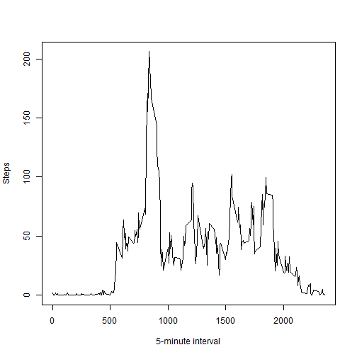
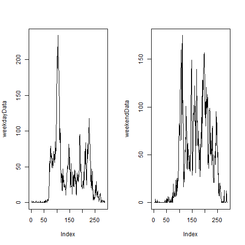

Reproducible Research Assessment 1
=======================================

###Loading and preprocessing the data

```r
dataOri <- read.csv('activity.csv')
data <- na.omit(dataOri)
steps <- tapply(data$steps, data$date, sum, na.rm=T)
```

###What is mean total number of steps taken per day?

```r
library(ggplot2)
qplot(steps)
```

```
## stat_bin: binwidth defaulted to range/30. Use 'binwidth = x' to adjust this.
```

 

```r
mean(steps, na.rm=T)
```

```
## [1] 10766.19
```

```r
median(steps, na.rm=T)
```

```
## [1] 10765
```

###What is the average daily activity pattern?

```r
daily <- tapply(data$steps, data$interval, mean)
plot(daily, type="l", x=names(daily), xlab="5-minute interval", ylab="Steps")
```

 

###Imputing missing values

```r
sum(is.na(dataOri$steps))
```

```
## [1] 2304
```

###Are there differences in activity patterns between weekdays and weekends?

```r
data2 <- data
data2$day <- weekdays(as.Date(data$date))
data2[,5] <- "weekday"
data2[data2$day == "Sunday" | data2$day == "Saturday", 5] <- "weekend"
names(data2)[5] <- "week"
weekday <- subset(data2, week == "weekday")
weekdayData <- tapply(weekday$steps, weekday$interval, mean)
weekend <- subset(data2, week=="weekend")
weekendData <- tapply(weekend$steps, weekend$interval, mean)
par(mfrow=c(1,2))
plot(weekdayData, type="l")
plot(weekendData, type="l")
```

 
